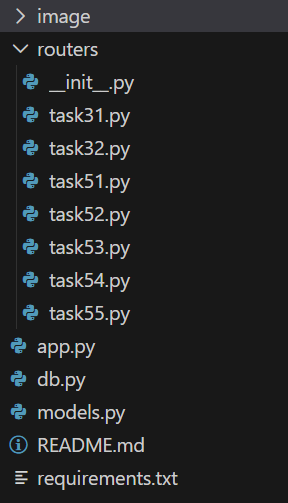

# Контрольная работа №2 — FastAPI

Серверное приложение на FastAPI, реализующее базовые механизмы работы с данными, аутентификацию через куки и обработку HTTP-заголовков.

После импорта из github загрузка библиотек и запуск сервера, с постоянным обновлением если будет изменение.

```bash
pip install -r requirements.txt
uvicorn app:app --reload
```

После запуска Swagger-документация доступна по адресу: http://localhost:8000/docs

---

## Структура



---

## Задания

### 3.1 — POST /create_user

Принимает данные пользователя в JSON. Поля `name` и `email` обязательны, `age` и `is_subscribed` — опциональные.

```bash
curl -X POST http://localhost:8000/create_user \
  -H "Content-Type: application/json" \
  -d '{"name": "Alice", "email": "alice@example.com", "age": 30, "is_subscribed": true}'
```

---

### 3.2 — GET /product/{product_id} и GET /products/search

Два маршрута для работы с товарами. Маршрут `/products/search` объявлен первым — иначе FastAPI попытается интерпретировать строку `search` как `int`.

```bash
# по ID
curl http://localhost:8000/product/123

# поиск с фильтрами
curl "http://localhost:8000/products/search?keyword=phone&category=Electronics&limit=5"
```

---

### 5.1 — Куки-аутентификация

Логин сохраняет `session_token` в куки (UUID). Маршрут `/user` проверяет наличие и валидность токена.

```bash
curl -c cookies.txt -X POST http://localhost:8000/login \
  -H "Content-Type: application/json" \
  -d '{"username": "user123", "password": "password123"}'

curl -b cookies.txt http://localhost:8000/user
```

Без куки или с неверным значением — `401 Unauthorized`.

---

### 5.2 — Подписанные куки (itsdangerous)

Токен имеет вид `<user_id>.<signature>`. Библиотека `itsdangerous` подписывает и верифицирует значение — любое изменение куки приводит к 401.

```bash
curl -c c52.txt -X POST http://localhost:8000/login52 \
  -H "Content-Type: application/json" \
  -d '{"username": "user123", "password": "password123"}'

curl -b c52.txt http://localhost:8000/profile
```

---

### 5.3 — Динамический TTL сессии

Токен: `<user_id>.<timestamp>.<hmac_signature>`

Логика обновления куки при обращении к `/profile53`:

| Время с последней активности | Результат |
|---|---|
| менее 3 мин | кука не меняется |
| от 3 до 5 мин | кука обновляется (+5 мин) |
| более 5 мин | 401 Session expired |

```bash
curl -c c53.txt -X POST http://localhost:8000/login53 \
  -H "Content-Type: application/json" \
  -d '{"username": "user123", "password": "password123"}'

curl -b c53.txt http://localhost:8000/profile53
```

---

### 5.4 — Чтение заголовков запроса

Эндпоинт `/headers` извлекает `User-Agent` и `Accept-Language` из запроса. Если заголовки отсутствуют — возвращает 400.

```bash
curl http://localhost:8000/headers \
  -H "User-Agent: Mozilla/5.0" \
  -H "Accept-Language: en-US,en;q=0.9"
```

---

### 5.5 — CommonHeaders (DRY)

Модель `CommonHeaders` на Pydantic переиспользуется в двух маршрутах — `/headers55` и `/info`. Маршрут `/info` дополнительно возвращает HTTP-заголовок `X-Server-Time` с текущим временем сервера.

```bash
curl http://localhost:8000/info \
  -H "User-Agent: Mozilla/5.0" \
  -H "Accept-Language: ru-RU,ru;q=0.9,en;q=0.8"
```

---

## Тестовые пользователи
username: user0
password: passwor0

username: admin0
password: admin0

